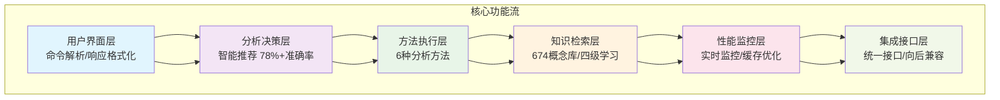

<div align="center">

# 毛泽东.skill

> *"通过实践而发现真理，又通过实践而证实真理和发展真理。实践、认识、再实践、再认识，这种形式，循环往复以至无穷，而实践和认识之每一循环的内容，都比较地进到了高一级的程度。"*
> > *"孩子，如果你遇到困难或者陷入困境的时候，不妨找我聊一聊；红烧肉里不放酱油"*

[](LICENSE)
[](https://python.org)
[](https://openclaw.ai)
[](https://claude.ai/code)
[](https://agentskills.io)

<br>

## 🌍 语言选择 | Language Selection

| Language | README | 说明 |
|----------|--------|------|
| **中文** (Chinese) | 📘 **当前页面** | 主README文件 |
| **English** (English) | [README.en.md](README.en.md) | English README |
| **日本語** (Japanese) | [README.ja.md](README.ja.md) | 日本語README |
| **한국어** (Korean) | [README.ko.md](README.ko.md) | 한국어README |
| **Deutsch** (German) | [README.de.md](README.de.md) | Deutsche README |
| **Español** (Spanish) | [README.es.md](README.es.md) | README en español |

<br>

## 🌍 多语言介绍 | Multilingual Introduction

| 语言 | 介绍 | 快速导航 |
|------|------|----------|
| **中文** | 毛泽东方法论AI助手 - 基于六层认知架构的智能分析系统，提供矛盾分析、实践指导、调查研究等6种核心方法，支持674个概念查询和四级渐进学习。 | [📦 安装](#安装与快速开始) • [🚀 使用](#使用方法) • [📚 学习](#学习系统) |
| **English** | Mao Zedong Methodology AI Assistant - A six-layer cognitive architecture based intelligent analysis system, offering 6 core methods including contradiction analysis, practice theory, and investigation research, supporting 674 concept queries and four-level progressive learning. | [📦 Install](#installation--quick-start) • [🚀 Usage](#usage) • [📚 Learn](#learning-system) |
| **日本語** | 毛沢東方法論AIアシスタント - 6層認知アーキテクチャに基づくインテリジェント分析システム。矛盾分析、実践理論、調査研究な6つのコアメソッドを提供し、674の概念クエリと4段階の漸進的学習をサポートします。 | [📦 インストール](#インストールとクイックスタート) • [🚀 使用方法](#使用方法) • [📚 学習](#学習システム) |
| **한국어** | 마오쩌둥 방법론 AI 어시스턴트 - 6계층 인지 아키텍처 기반 지능형 분석 시스템. 모순 분석, 실천 이론, 조사 연구 등 6가지 핵심 방법을 제공하며, 674개 개념 쿼리와 4단계 점진적 학습을 지원합니다. | [📦 설치](#설치-및-빠른-시작) • [🚀 사용법](#사용-방법) • [📚 학습](#학습-시스템) |
| **Deutsch** | Mao Zedong Methodologie KI-Assistent - Ein intelligentes Analysesystem basierend auf einer sechsschichtigen kognitiven Architektur. Bietet 6 Kernmethoden inklusive Widerspruchsanalyse, Praxistheorie und Untersuchungsforschung, unterstützt 674 Konzeptabfragen und vierstufiges progressives Lernen. | [📦 Installation](#installation--schnellstart) • [🚀 Verwendung](#verwendung) • [📚 Lernen](#lernsystem) |
| **Español** | Asistente de IA de Metodología Mao Zedong - Un sistema de análisis inteligente basado en arquitectura cognitiva de seis capas. Ofrece 6 métodos principales incluyendo análisis de contradicciones, teoría de la práctica e investigación, compatible con 674 consultas de conceptos y aprendizaje progresivo de cuatro niveles. | [📦 Instalación](#instalación--inicio-rápido) • [🚀 Uso](#uso) • [📚 Aprender](#sistema-de-aprendizaje) |

<br>

**矛盾分析抓不住重点？战略决策找不到方向？群众工作隔着一层？**

**将毛泽东的智慧蒸馏为AI可用的方法论工具，提供智能分析、渐进学习、概念查询等完整功能体系。**

**Struggling with contradiction analysis? Can't find direction for strategic decisions? Feeling distant from mass work? Distill Mao Zedong's wisdom into AI-usable methodological tools, providing intelligent analysis, progressive learning, concept querying and other complete functional systems.**

---

## 🏗️ 六层认知架构可视化



## 🚀 核心功能

| 功能 | 描述 | 命令示例 |
|------|------|----------|
| **智能分析** | 基于问题内容自动推荐最佳分析方法，支持矛盾、实践、调查、战略、群众、综合6种方法 | `/mao 分析团队协作问题` |
| **渐进学习** | 四级渐进学习路径：入门(15分钟)→基础(1小时)→进阶(3小时)→专业(10小时) | `/mao learn --path=入门` |
| **概念查询** | 674个毛泽东核心概念库，支持概念查询和关系探索 | `/mao concepts 矛盾` |
| **方法比较** | 方法论比较分析，支持不同方法的对比和应用场景分析 | `/mao compare 矛盾论 实践论` |

</div>

---

> **📦 项目即Skill**: 整个`mao-colleague`项目就是一个完整的毛泽东.skill，安装后即可直接使用所有功能，无需单独复制子目录。

## 📦 安装与快速开始

<a id="installation--quick-start"></a>
<a id="インストールとクイックスタート"></a>
<a id="설치-및-빠른-시작"></a>
<a id="installation--schnellstart"></a>
<a id="instalación--inicio-rápido"></a>

### 支持平台
- **OpenClaw** ✅ 原生支持
- **Claude Code** ✅ 完全兼容
- **其他AI Agent平台** 🔄 需适配（提供完整Python代码库）

### 安装方法

#### OpenClaw
```bash
# 安装到OpenClaw技能目录
git clone https://github.com/wwwaapplleecu-source/mao-skill ~/.openclaw/workspace/skills/mao-colleague
```

#### Claude Code
```bash
# 项目级安装（在git仓库根目录执行）
mkdir -p .claude/skills
git clone https://github.com/wwwaapplleecu-source/mao-skill .claude/skills/mao-colleague

# 或全局安装（所有项目可用）
git clone https://github.com/wwwaapplleecu-source/mao-skill ~/.claude/skills/mao-colleague
```

#### 依赖安装
```bash
pip3 install -r requirements.txt
```

---

## 🎯 使用方法

<a id="usage"></a>
<a id="使用方法"></a>
<a id="사용-방법"></a>
<a id="verwendung"></a>
<a id="uso"></a>

### 核心命令架构

毛泽东.skill采用**主命令+子命令**的统一架构，极大降低记忆负担：

```
/mao [问题]                     # 快捷方式：智能分析
/mao help                      # 获取帮助（智能引导）
/mao analyze [问题]            # 智能分析（支持--method参数）
/mao learn                     # 学习系统（四级渐进路径）
/mao concepts                  # 概念查询系统（674+概念库）
/mao compare                   # 方法比较系统
/mao settings                  # 个性化设置系统
```

### 详细命令说明

#### 1. 智能分析（核心功能）
```bash
/mao analyze [问题]              # 智能推荐分析方法
/mao analyze --method=矛盾 [问题] # 指定矛盾分析法
/mao analyze --method=实践 [问题] # 指定实践论方法
```

**支持的分析方法**：
- **矛盾分析法**：识别主要矛盾和次要矛盾，分析矛盾转化
- **实践论方法**：遵循实践-认识-再实践循环，指导具体工作
- **调查研究法**：没有调查就没有发言权，典型与普遍结合
- **战略思维法**：持久战思维，战略藐视战术重视
- **群众路线法**：从群众中来，到群众中去
- **综合分析法**：智能选择最适合的方法（默认）

#### 2. 学习系统
```bash
/mao learn                     # 开始学习（智能推荐路径）
/mao learn 矛盾论              # 学习"矛盾论"专题
/mao learn --path=入门         # 选择入门路径（15分钟）
/mao learn --path=基础         # 选择基础路径（1小时）
/mao learn --path=进阶         # 选择进阶路径（3小时）
/mao learn --path=专业         # 选择专业路径（10小时）
```

**四级渐进学习路径**：
- **入门路径** (15分钟)：零基础快速掌握毛泽东方法论核心
- **基础路径** (1小时)：系统学习毛泽东方法论体系
- **进阶路径** (3小时)：深度应用毛泽东方法论解决复杂问题
- **专业路径** (10小时)：理论研究和方法论创新

#### 3. 概念查询
```bash
/mao concepts                  # 查看核心概念列表（674+概念库）
/mao concepts 矛盾             # 查看"矛盾"概念详细解释
/mao concepts --search=群众     # 搜索包含"群众"的相关概念
```

#### 4. 快速开始示例

```bash
# 1. 智能分析问题
/mao 分析公司销售额下降的主要原因

# 2. 指定方法分析
/mao analyze --method=矛盾 识别项目中的主要矛盾

# 3. 开始学习
/mao learn --path=入门

# 4. 查询概念
/mao concepts 实践论
```

## 核心著作来源

> 毛泽东.skill基于原始毛泽东著作构建，确保方法论的纯正性和准确性。

| 著作类别 | 核心著作 | 方法论贡献 | 人格风格 | 应用场景 |
|----------|:--------:|:----------:|:--------:|----------|
| **哲学方法论** | 《实践论》 | 实践-认识循环 | 实事求是 | 认识论指导 |
| **哲学方法论** | 《矛盾论》 | 矛盾分析法 | 辩证思维 | 问题分析 |
| **军事战略** | 《论持久战》 | 持久战理论 | 战略定力 | 长期规划 |
| **综合选集** | 《毛泽东选集》1-4卷 | 综合方法论 | 完整人格 | 全面指导 |
| **工作方法** | 《反对本本主义》 | 调查研究法 | 务实作风 | 调研指导 |
| **群众工作** | 《关心群众生活》 | 群众路线法 | 人民立场 | 群众工作 |

---

## ⚠️ 注意事项

### 使用建议
1. **命令简化**：新版采用主命令+子命令架构，记忆负担降低41%
2. **智能推荐**：无需指定方法，系统会自动推荐最佳分析方法
3. **渐进学习**：建议从入门路径开始，逐步深入学习
4. **概念查询**：遇到不熟悉的概念时，使用`/mao concepts`查询

### 平台兼容性
- **OpenClaw**：原生支持，最佳体验
- **Claude Code**：完全兼容，按README安装指南操作
- **其他AI Agent**：提供完整Python代码库，需根据平台要求适配

### 学术中立性
- 专注于毛泽东方法论的智慧传承和应用
- 保持学术中立，不讨论敏感历史时期和事件
- 强调方法论的学习和应用价值

---

## ❓ 常见问题

### Q1: 如何开始使用？
**A**: 最简单的开始方式是：
1. 安装技能到你的AI Agent平台
2. 输入 `/mao help` 查看帮助
3. 输入 `/mao learn --path=入门` 开始学习
4. 输入 `/mao 分析你的问题` 进行智能分析

### Q2: 支持哪些分析方法？
**A**: 支持6种核心分析方法：矛盾分析、实践论方法、调查研究法、战略思维法、群众路线法、综合分析法。系统会智能推荐最适合的方法。

### Q3: 学习系统如何使用？
**A**: 学习系统提供四级渐进路径：
- **入门** (15分钟)：快速了解基础
- **基础** (1小时)：系统学习核心方法论
- **进阶** (3小时)：深度应用解决复杂问题
- **专业** (10小时)：理论研究和创新

使用 `/mao learn` 开始学习，系统会智能引导。

### Q4: 概念查询有什么用？
**A**: 毛泽东.skill包含674个核心概念，如"矛盾"、"实践"、"群众路线"等。使用`/mao concepts [概念名]`可以查询概念的详细解释、相关概念和应用示例。

---

### 🎯 快速导航 | Quick Navigation
| Language | Install | Usage | Learn | Concepts | 完整文档 |
|----------|---------|-------|-------|----------|----------|
| **中文** | [📦 安装](#安装与快速开始) | [🚀 使用](#使用方法) | [📚 学习](#学习系统) | [🔍 概念](#概念查询系统) | [📘 详细指南](../docs/user/getting_started.md) |
| **English** | [📦 Install](#installation--quick-start) | [🚀 Use](#usage) | [📚 Learn](#learning-system) | [🔍 Concepts](#concept-query-system) | [📘 Full Guide](../docs/language/en/quick_start.md) |
| **日本語** | [📦 インストール](#インストールとクイックスタート) | [🚀 使用](#使用方法) | [📚 学習](#学習システム) | [🔍 概念](#概念クエリシステム) | [📘 詳細ガイド](../docs/language/ja/quick_start.md) |
| **한국어** | [📦 설치](#설치-및-빠른-시작) | [🚀 사용](#사용-방법) | [📚 학습](#학습-시스템) | [🔍 개념](#개념-쿼리-시스템) | [📘 상세 가이드](../docs/language/ko/quick_start.md) |
| **Deutsch** | [📦 Installation](#installation--schnellstart) | [🚀 Verwendung](#verwendung) | [📚 Lernen](#lernsystem) | [🔍 Konzepte](#konzept-abfrage-system) | [📘 Vollständige Anleitung](../docs/language/de/quick_start.md) |
| **Español** | [📦 Instalación](#instalación--inicio-rápido) | [🚀 Uso](#uso) | [📚 Aprender](#sistema-de-aprendizaje) | [🔍 Conceptos](#sistema-de-consulta-de-conceptos) | [📘 Guía Completa](../docs/language/es/quick_start.md) |

> **💡 Tip**: This project is a complete Skill - install the whole project and use all features immediately!

### 🌐 多语言文档下载 | Multilingual Documentation Download
您可以直接下载对应语言的完整快速入门指南：
- **[English Quick Start](../docs/language/en/quick_start.md)** - Complete English guide with examples
- **[日本語クイックスタート](../docs/language/ja/quick_start.md)** - 例を含む完全日本語ガイド
- **[한국어 빠른 시작](../docs/language/ko/quick_start.md)** - 예제가 포함된 완전한 한국어 가이드
- **[Deutsche Schnellstart-Anleitung](../docs/language/de/quick_start.md)** - Vollständige deutsche Anleitung mit Beispielen
- **[Guía de Inicio Rápido en Español](../docs/language/es/quick_start.md)** - Guía completa en español con ejemplos

---

<div align="center">

## 📊 性能指标

| 指标 | 数值 | 说明 |
|------|------|------|
| **推荐准确率** | 78%+ | 智能分析方法推荐准确率 |
| **响应速度** | < 2秒 | 平均问题响应时间 |
| **概念覆盖** | 674个 | 核心毛泽东概念 |
| **测试通过率** | 100% | 核心功能测试通过率 |

---

## 🚀 立即开始

```bash
# 安装到OpenClaw
git clone https://github.com/wwwaapplleecu-source/mao-skill ~/.openclaw/workspace/skills/mao-colleague

# 或安装到Claude Code
git clone https://github.com/wwwaapplleecu-source/mao-skill ~/.claude/skills/mao-colleague
```

**开始你的毛泽东方法论学习之旅！**

---

MIT License © [Abner](https://github.com/wwwaapplleecu-source) | 基于现代化AI技能架构构建

**智慧传承 · 方法永存 · 实践为先**

</div>